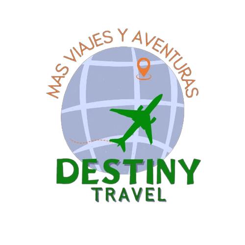

   

Destiny Travel es una empresa de viajes apasionada por ofrecer experiencias emocionantes y memorables. Desde 2020, ha estado llevando a viajeros de todo el mundo a destinos asombrosos, creando recuerdos que duran toda la vida.
  

# Contenidos
- [Tecnologías](#tecnologías)
- [Colaboradores](#colaboradores)

## Tecnologías

  

 

## Colaboradores
| [ Mansilla, Cristian](https://github.com/CristianMansilla) |  [ Martínez, Mauricio](https://github.com/CristianMansill) |  [ Ojeda, María](https://github.com/CristianMansill)
| :---: | :---: | :---: |

---
<h2>Gracias por visitar nuestro proyecto!</h2>

---